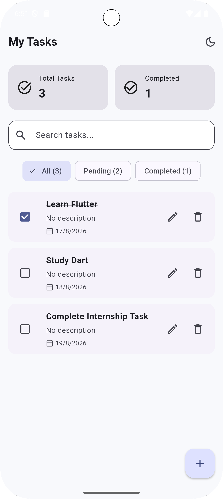
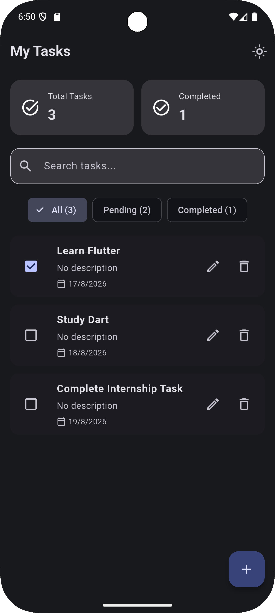
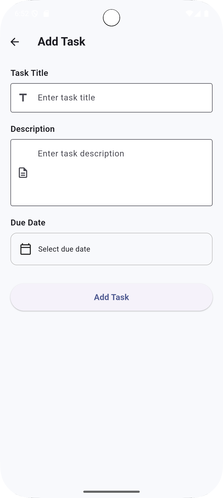
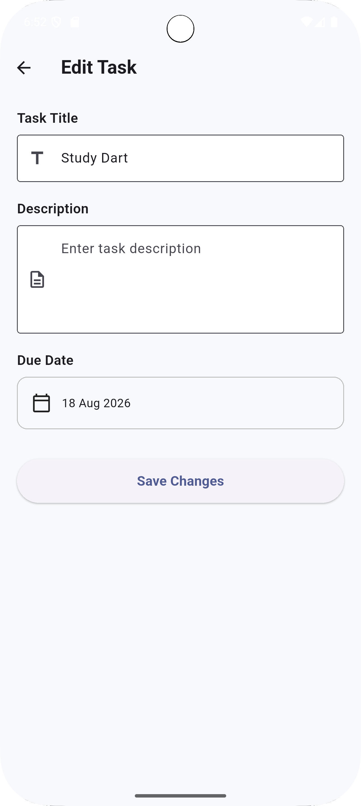
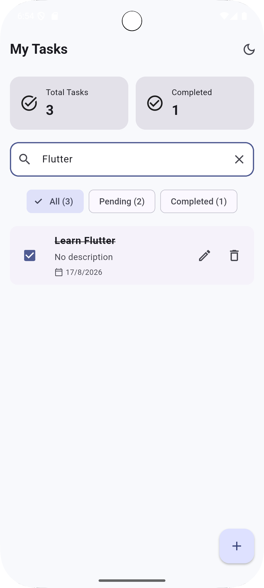
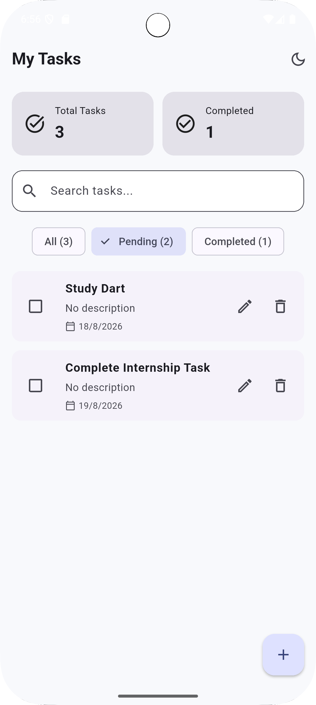
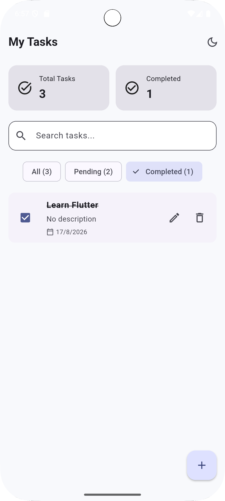
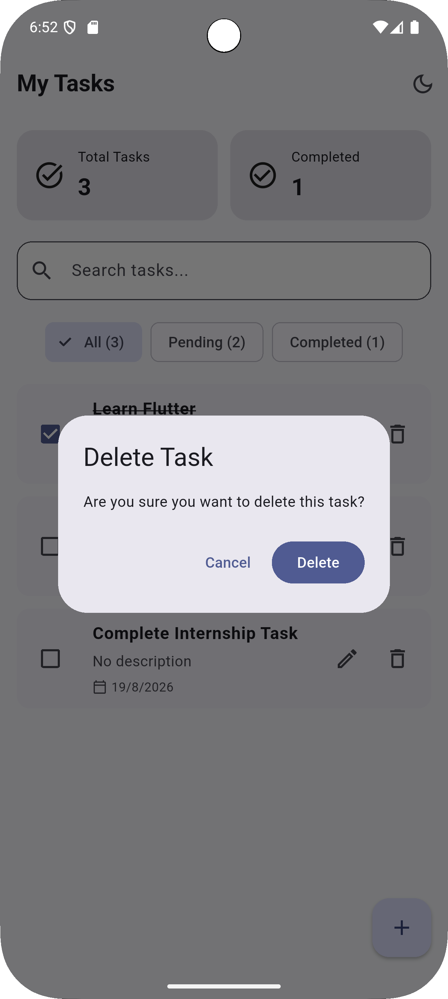

# Task Manager 📋

A cross-platform Flutter task management application designed to help users create, organize, search, filter, and manage their daily tasks.

## ✨ Features

* Create tasks
* View tasks
* Edit tasks
* Delete tasks
* Mark tasks as completed
* Set due dates
* Search by title or description
* Filter by All, Pending, and Completed
* Light Mode
* Dark Mode
* Persistent theme preference
* Local data persistence
* Responsive UI

## 🛠️ Tech Stack

* **Flutter**
* **Dart**
* **Hive**
* **SharedPreferences**
* **BLoC / Cubit**
* **Material 3**

## 🏗️ Architecture

The application follows a simple layered structure:

```text
UI
 ↓
Cubit
 ↓
Repository
 ↓
Hive
 ↓
Local Storage
```

This structure separates the user interface, state management, repository logic, and local data storage.

## 💾 Local Storage

The application uses Hive to store task data locally.

Each task contains:

* ID
* Title
* Description
* Creation Date
* Due Date
* Completion Status

Task data remains available after restarting the application.

## 🔎 Search & Filtering

Users can search for tasks by title or description.

Tasks can also be filtered by:

* All
* Pending
* Completed

## 🌙 Theme

The application supports both Light Mode and Dark Mode.

The selected theme is stored using SharedPreferences and restored automatically when the application starts again.

## 📱 Screenshots

### Home Screen - Light Mode



### Home Screen - Dark Mode



### Add Task



### Edit Task



### Search



### Pending Tasks



### Completed Tasks



### Delete Confirmation



## 🚀 Getting Started

Clone the repository:

```bash
git clone https://github.com/nouranagiy/task-manager-flutter.git
```

Navigate to the project:

```bash
cd task-manager-flutter
```

Install dependencies:

```bash
flutter pub get
```

Run the application:

```bash
flutter run
```

## 📁 Project Structure

```text
lib/
├── core/
│   └── theme/
│       └── app_theme.dart
├── cubit/
│   └── task_cubit.dart
├── data/
│   ├── local/
│   │   └── task_adapter.dart
│   └── repositories/
│       └── task_repository.dart
├── models/
│   └── task_model.dart
├── screens/
│   ├── add_task_screen.dart
│   └── home_screen.dart
└── main.dart
```

## 📚 Documentation

The project report is available in:

```text
docs/Task_2_Report.pdf
```

## 👩‍💻 Author

**Nora Nagiy**

Flutter Developer

## 📌 Project

This project demonstrates practical Flutter development skills including local database integration, CRUD operations, state management, responsive UI, search, filtering, and theme persistence.
